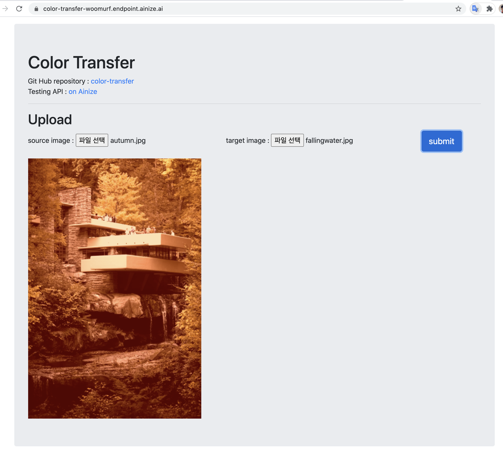

you can test this project's API now!

---

# Color Transfer

This provide API server and Web server about [color_transfer](https://github.com/jrosebr1/color_transfer)
`color_transfer` package transfer color from source image to target image super fast.

### Requirement
* color_transfer ( you can install using pip ex. `pip install color_transfer` )
* Open-CV
* NumPy 
* Docker

### How to deploy?
1. `docker build -t ${image name} . `
2. `docker run -p 80:80 -d --name ${name} ${image name}`

now the server is available at [http://localhost](http://localhost).

### How to Use?
1. select source image file and target image file 
2. and click `submit`

**source Image**
 
 

**target Image**
 

**Result**
 
